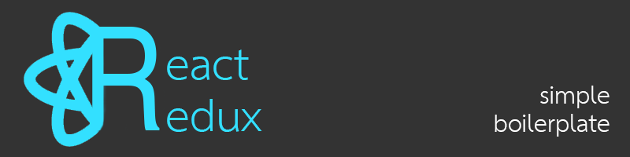

Contains:

* ES6 - 7 Support with Babel
* Routing
* Webpack hot reload
* Webpack production build
* Css modules support, just import your styles wherever you need them
* eslint and stylelint to keep your js readable
* much more...

This project was based on two other boilerplates:
- https://github.com/brunolm/ts-react-redux-startup
- https://github.com/jpsierens/webpack-react-redux

## Run the app

0. ```npm install```
0. ```npm start:dev```

## Build the app
```npm run build```

This will build the app into the "dist" directory in the root of the project. It contains the index.html along with the minified assets, ready for production.

After built, you can use ```npm start``` in your production server.
